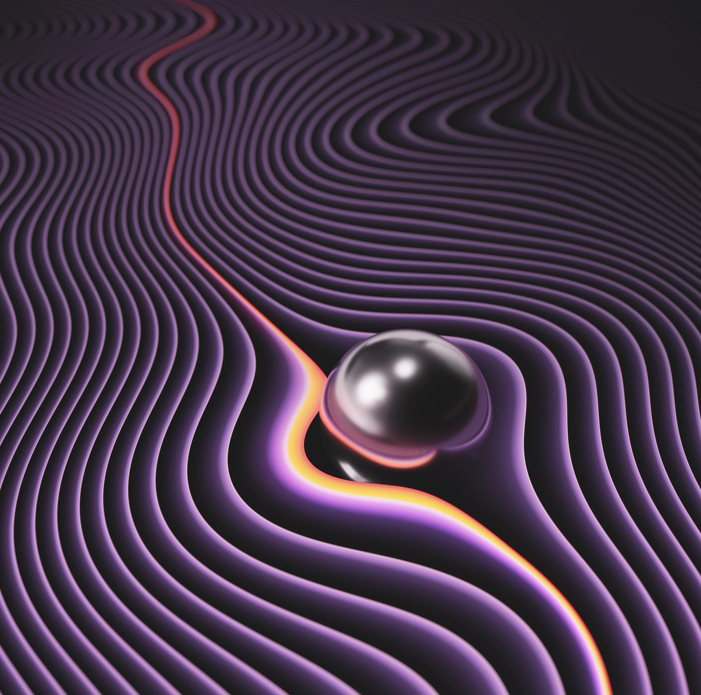
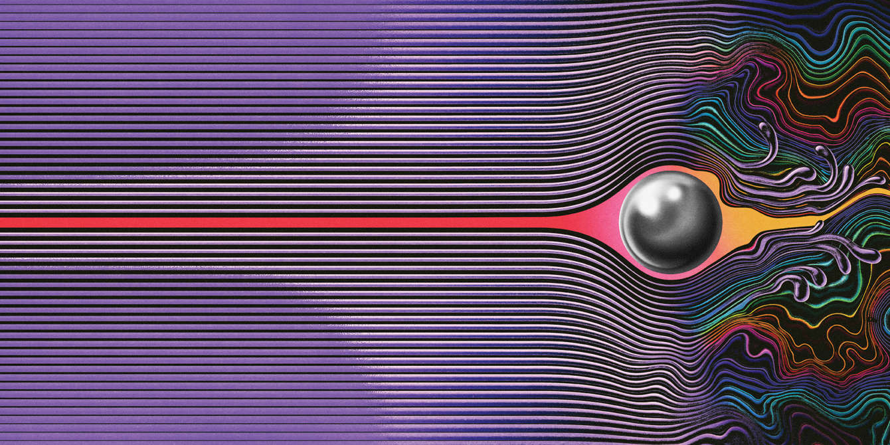
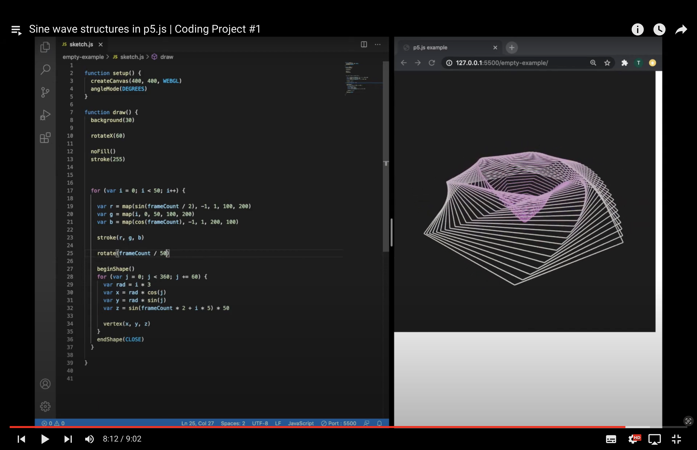

# dcha0516_9103_week8

# PART 1

The imaging technique that I found inspiring is the album cover of the **Currents**
*album by Tame Impala* who is an australian musician. This composition features a 
psychedelic design with vibrant colours, it has smooth lines that are a shade 
of purple with the black canvas for the background, there are purple, red and 
yellow lines which are interrupted by the metallic sphere, which represent a collision between chaos and order, echoing themes of disruption and transformation
The colour palette creates a sense of movement

The smooth, wavy lines evoke a sense of flow and rhythm, much like the sonic landscape of the album itself

## This design inspires projects focused on 
- visualizing flow
 - disruption
 - movement.
#

# **First iteration**

# **Second iteration**

#
#

# PART 2

I found the video titles **Sine wave structures in p5.js | Coding Project #1** by *Colourful Coding* 
I can replicate the wavy lines of the Currents album cover using this technique which uses the *vertices* in p5.js
it will help me create smooth, flowing patterns that mimic the album's psychedelic aesthetics. This method allows for dynamic control while also enabling the creation of ripple effects similar to the disrupted lines in the artwork of the *CURRENTS* album. 

These sine waves let me easily control things like how tall the waves are, how many waves appear in a certain space and how the waves shift along their path. Thus I can fine-tune the design, creating a sense of movement and distortion, similar to how the metallic sphere interferes the flow of lines in the *Currents* album cover.

#

## The coding technique in action

#

[THE CODING TUTORIAL](https://www.youtube.com/watch?v=vmhRlDyPHMQ&list=PLwUlLzAS3RYow0T9ZXB0IomwB-DyBRTfm)

##

[LINK TO THE CODE](https://github.com/colorful-coding/coding-projects/tree/edbd96c2be216d64cca10d519a4a3b5818f79164/Coding%20Project%20%231%20-%20code)

#
